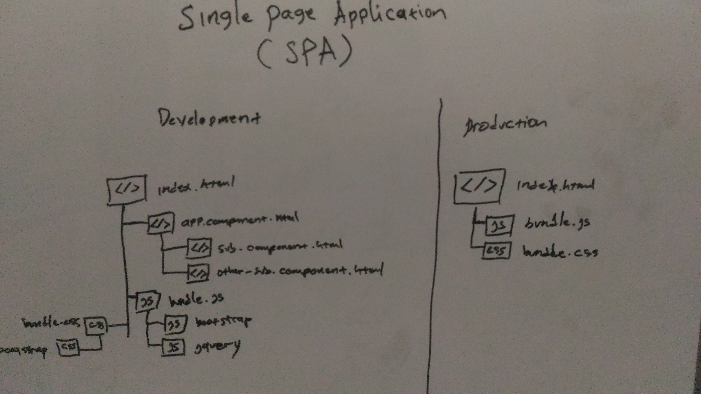
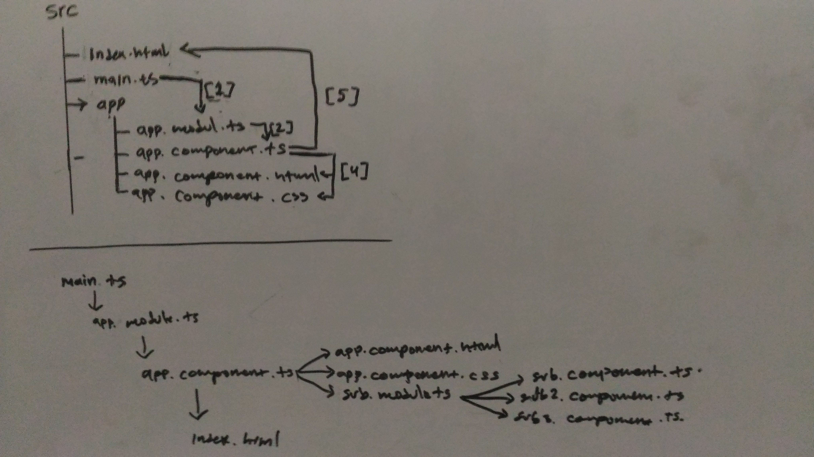

# Belajar Angular4

Angular adalah JavaScript framework untuk membuat aplikasi berbasis *Single Page Application* (SPA), SPA atau Single Page Application itu kurang lebih intinya hanya punya 1 halaman saja yang ditampilkan oleh browser (client) meski di dalamnya memiliki banyak file `.html` tetapi dengan angular akan merender atau memanipulasi *Domain Object Model* DOM dalam HTML supaya menjadi 1 halaman saja.



## Perbedaan _the version of Angular_

- AngularJs = AngularJs adalah ditulis dengan `.js` Javascript based. AngularJs adalah versi pertama dari Angular yang ditulis dengan bahasa Javascript dengan extension `.js`. Untuk belajar Angular2 atau Angular4 tidak harus belajar angularJs dulu karena ada perbedaan konsep didalamnya tetapi klo sudah pernah menggunakan angularJs akan lebih baik hanya tinggal menyesuaikan saja.
- Angular2 = Angular adalah ditulis dengan `.ts` Typescript based. Typescript adalah superset of typescript atau istilahnya framework dari Javascript, Jadi AngularJs versi 2 ini atau Angular2 sebutannya dia untuk saat ini menggunakan bahasa Typescript sebagai primary languagenya. Karena typescript memiliki kesamaan dengan sintax Java, C++, .Net dll. Typescript ini berbada dengan Javascript di sisi konsep klo Javascript menggunakan konsep _first class function_ atau di bungkus dengan function sedangan untuk typescript dibungkus dengan _class based_ Object Oriented pada umumnya.
- Angular4 adalah Updated versi dari Angular2.

## Membuat project dengan Angular-CLI

Angular-CLI adalah tools untuk membuat project, generate component, generate page, generate pipe dan masih banyak lagi ya, jadi AngularCLI ini adalah tools berbasis commandline untuk memudahkan kita (developer) membuat web berbasis angular.

### Intallation NodeJS

Untuk menginstall AngularCLI kita butuh package managernya Javascript yaitu `NPM v.4.x or letter` dan `Node v.6.x or letter` di Ubuntu menggunakan perintah berikut:

```sh 
curl -sL https://deb.nodesource.com/setup_8.x | sudo -E bash -
sudo apt-get install -y nodejs build-essential
```

Setelah install package `NodeJs` secara otomatis kita memiliki package `npm` nah sekaran coba cek versinya menggunakan perintah berikut:

```sh 
dimmaryanto93@Aspire-E5-473G:~$ node -v
v8.8.1 # << the node version is 8.8.1
``` 

dan versi dari npm version seperti berikut:

```sh 
dimmaryanto93@Aspire-E5-473G:~$ npm -v
5.5.1 # << the npm version is 5.5.1
```

### Installing `@angular/cli`

Untuk menginstall package `@angular/cli` direkomentasikan menggunakan package `node` dan `npm` terbaru karena saya disini saat ini (Oktober 2017) masih menggunakan Angular4 masih works fine....

Untuk install angularCLI di linux membutuhkan superuser untuk installnya seperti berikut:

```sh 
npm install -g typescript lite-server @angular/cli
```

## Membuat project dengan `@angular/cli`

Untuk membuat project dengan angularCLI bisa dengan menggunakan perintah:

```sh 
ng new angular4 #example used >> ng new [project-name]
```

## Structure directory of Angular4

### e2e folder

folder ini biasanya digunakan sebagai unit testing di angular 

```sh 
e2e/
├── app.e2e-spec.ts
├── app.po.ts
└── tsconfig.e2e.json

0 directories, 3 files
```

### node_modules folder

folder ini isinya adalah lib javascript yang dibuntuhkan oleh angular

```sh 
├── @angular
├── @types
├── @webpack
└── typescript
.
.
.
.
3190 directories, 22978 files
```

### src 

Di folder ini kita akan menulis halaman, service, component, pipe, dan lain-lain untuk membuat aplikasi angular

```sh 
src/
├── app
│   ├── app.component.css
│   ├── app.component.html
│   ├── app.component.spec.ts
│   ├── app.component.ts
│   └── app.module.ts
├── assets
├── environments
│   ├── environment.prod.ts
│   └── environment.ts
├── favicon.ico
├── index.html
├── main.ts
├── polyfills.ts
├── styles.css
├── test.ts
├── tsconfig.app.json
├── tsconfig.spec.json
└── typings.d.ts

3 directories, 16 files
```

### Other files 

```sh 
├── angular-cli.json
├── .editorconfig
├── karma.conf.js
├── package.json
├── package-lock.json
├── protractor.conf.js
├── README.md
├── tsconfig.json
└── tslint.json
```

## Undestanding the setup of AngularJs Project

Untuk setup project angular, kita buat yang paling sering digunakankan ja ya supaya tidak terlalu banyak diantaranya seperti berikut:

* `tsconfig.json`
* `package.json`
* `angular-cli.json` 

### `tsconfig.json`

```json
{
  "compileOnSave": false,
  "compilerOptions": {
    "outDir": "./dist/out-tsc",
    "sourceMap": true,
    "declaration": false,
    "moduleResolution": "node",
    "emitDecoratorMetadata": true,
    "experimentalDecorators": true,
    "target": "es5",
    "typeRoots": [
      "node_modules/@types"
    ],
    "lib": [
      "es2017",
      "dom"
    ]
  }
}
```

Banyak property nah jadi kita jelaknan satu-persatu ya

  * `compileOnSave` tujuannya ketika file di save nanti npm akan compile otomatis
  * `compilerOptions` adalah opsi compiler bagi `tsc`
    * `outDir` adalah nantnya khan typescript akan menghasilkan file dengan format javascript nah hasilcompilenya itu akan di simpan di folder `dist/out-tsc`
    * `sourceMap` ini tujuannya jika bernilai `true` ini akan mempermudah ketika development karena error messagenya akan di tujukan langsung di typescriptnya tpi klo nilainya `false` biasanya error lognya di arahin ke javascript.
    * `moduleResoulution` ini digunakan untuk system modulenya menggunakan `node` artinya nodeJs
    * `emitDecoratorMetadata` dan `experimentalDecorators` digunakan untuk mengaktifkan decorator klo di java decorator itu seperti annotation `@Component`
    * `target` ini adalah setelah di compile di ubah ke versi javascript seperti contohnya `es5` ini berpengaruh di browsernya apakah udah support.
    
    
### `package.json`

```json
{
  "name": "first-ng-app",
  "version": "0.0.0",
  "license": "MIT",
  "scripts": {
    "ng": "ng",
    "start": "ng serve",
    "build": "ng build",
    "test": "ng test",
    "lint": "ng lint",
    "e2e": "ng e2e"
  },
  "private": true,
  "dependencies": {
    "@angular/animations": "^4.2.4",
    "@angular/common": "^4.2.4",
    "@angular/compiler": "^4.2.4",
    "@angular/core": "^4.2.4",
    "@angular/forms": "^4.2.4",
    "@angular/http": "^4.2.4",
    "@angular/platform-browser": "^4.2.4",
    "@angular/platform-browser-dynamic": "^4.2.4",
    "@angular/router": "^4.2.4",
    "core-js": "^2.4.1",
    "rxjs": "^5.4.2",
    "zone.js": "^0.8.14"
  },
  "devDependencies": {
    "@angular/cli": "1.4.2",
    "@angular/compiler-cli": "^4.2.4",
    "@angular/language-service": "^4.2.4",
    "@types/jasmine": "~2.5.53",
    "@types/jasminewd2": "~2.0.2",
    "@types/node": "~6.0.60",
    "codelyzer": "~3.1.1",
    "jasmine-core": "~2.6.2",
    "jasmine-spec-reporter": "~4.1.0",
    "karma": "~1.7.0",
    "karma-chrome-launcher": "~2.1.1",
    "karma-cli": "~1.0.1",
    "karma-coverage-istanbul-reporter": "^1.2.1",
    "karma-jasmine": "~1.1.0",
    "karma-jasmine-html-reporter": "^0.2.2",
    "protractor": "~5.1.2",
    "ts-node": "~3.2.0",
    "tslint": "~5.3.2",
    "typescript": "~2.3.3"
  }
}
```

Nah `package.json` ini pada dasarnya sama seperti `pom.xml` jadi isinya berupa nama aplikasi, versi aplikasi dan dependency yang kita gunakan. Ok nah kita jelaskan aja ya

* `name` ini adalah nama aplikasi kita
* `version` ini adalah versi untuk aplikasi kita
* `lisence` ini adalah lisence yang digunakan contohnya seperti `MIT`, `GNU`, dll.
* `script` ini adalah script untuk menjalakan perntah contohnya `ng start`
* `dependencies` dan `devDependencies` adalah library yang kita gunakan bedanya adalah klo `dependencies` itu lib yang bener2 dipake di production nah sedangkan `devDependencies` itu biasanya digunakan untuk development contohnya `lite-server` nah karena kita butuh server yang embedded ketika development jadi kita butuh itu tpi klo udah production khan udah ada web server yang di install tersediri di sistem jadi ya gak perlu lagi pake `lite-server`.


### `angular-cli.json`

```json
{
  "$schema": "./node_modules/@angular/cli/lib/config/schema.json",
  "project": { "name": "first-ng-app" },
  "apps": [
    {
      "root": "src",
      "outDir": "dist",
      "assets": [
        "assets",
        "favicon.ico"
      ],
      "index": "index.html",
      "main": "main.ts",
      "polyfills": "polyfills.ts",
      "test": "test.ts",
      "tsconfig": "tsconfig.app.json",
      "testTsconfig": "tsconfig.spec.json",
      "prefix": "app",
      "styles": [ "styles.css" ],
      "scripts": [],
      "environmentSource": "environments/environment.ts",
      "environments": {
        "dev": "environments/environment.ts",
        "prod": "environments/environment.prod.ts"
      }
    }
  ],
  "e2e": {
    "protractor": { "config": "./protractor.conf.js" }
  },
  "lint": [
    { "project": "src/tsconfig.app.json" },
    { "project": "src/tsconfig.spec.json" },
    { "project": "e2e/tsconfig.e2e.json" }
  ],
  "test": {
    "karma": { "config": "./karma.conf.js" }
  },
  "defaults": {
    "styleExt": "css",
    "component": {}
  }
}
```

Setup file `angular-cli.json` ini hanya berlalu jika menggunakan `@angular/cli` sebagai temlate projectnya jadi di atas terdiri dari beberapa property yaitu seperti berikut:

* `$schema` ini adalah schema yang digunakan untuk angularjs mapping system projectnya
* `name` ini adalah nama aplikasi kita
* `apps`
  * `root` adalah source code kita untuk aplikasi angular js
  * `outDir` adalah output yaitu hasil compile ke javascript
  * `index` adalah halaman utama yang akan diload
  * `styles` adalah file-file css yang akan diload dan nantnya di webpack atau di bundle sebagai include file css contohnya include file `bootstrap` dengan manambahkan dari node_modules seperti berikut `../node_modules/bootstrap/css/bootstrap.min.css`
  * `scripts` adalah file-file js yang akan diload dan nantinya akan di webpack atau di bundle sebagai include file js contohnya include file `jquery`
  

## Setup Styling with bootstrap

Untuk menambahkan library bootstrap di project angular4 dengan template project via `@angular/cli`, saya mau tambahkan melalui `npm` yaitu seperti berikut

```sh 
npm install jquery bootstrap --save
```

Maka outpunya seperti berikut:

```sh 
dimmaryanto93@Aspire-E5-473G:~/Documents/angular4$ npm install jquery bootstrap --save
npm WARN optional SKIPPING OPTIONAL DEPENDENCY: fsevents@1.1.2 (node_modules/fsevents):
npm WARN notsup SKIPPING OPTIONAL DEPENDENCY: Unsupported platform for fsevents@1.1.2: wanted {"os":"darwin","arch":"any"} (current: {"os":"linux","arch":"x64"})

+ bootstrap@3.3.7
+ jquery@3.2.1
added 116 packages in 26.785s
```

And then saya mau include `bootstrap` dan `jquery` ke project saya, dengan cara tambahkan di properti `styles` untuk stylesheet atau css dan `scripts` untuk javascript file di dalam file `.angular-cli.json` seperti berikut:

```js 
"apps": [
    {
      // add here *.css with relative path
      "styles": [
        "styles.css",
        "../node_modules/bootstrap/dist/css/bootstrap.min.css",
        "../node_modules/bootstrap/dist/css/bootstrap-theme.min.css"
      ],
      // add here *.js with relative path
      "scripts": [
        "../node_modules/jquery/dist/jquery.min.js",
        "../node_modules/bootstrap/dist/js/bootstrap.min.js"
      ],
      
    }
  ]
```

## Run the project

Untuk menjalankan aplikasi angular dengan template project via `@angular/cli` itu sangat mudah cukup dengan perintah `ng serve --open` maka outputnya seperti berikut:

```sh 
dimmaryanto93@Aspire-E5-473G:~/Documents/angular4$ ng serve
** NG Live Development Server is listening on localhost:4200, open your browser on http://localhost:4200/ **
Date: 2017-10-28T13:14:33.490Z                                                          
Hash: f17012aebd21bff7f981
Time: 16044ms
chunk {inline} inline.bundle.js, inline.bundle.js.map (inline) 5.83 kB [entry] [rendered]
chunk {main} main.bundle.js, main.bundle.js.map (main) 7.44 kB {vendor} [initial] [rendered]
chunk {polyfills} polyfills.bundle.js, polyfills.bundle.js.map (polyfills) 217 kB {inline} [initial] [rendered]
chunk {styles} styles.bundle.js, styles.bundle.js.map (styles) 149 kB {inline} [initial] [rendered]
chunk {vendor} vendor.bundle.js, vendor.bundle.js.map (vendor) 2.3 MB [initial] [rendered]

webpack: Compiled successfully.
```

Nah dengan begitu saja kita bisa buka di browser masukan url [http://localhost:4200](http://localhost:4200/) hasilnya seperti berikut jika dibuka di browser 


## How angular run project works

When you run the project via angular-cli, and then show the source page via browser you will see the `index.html` content. itu akan sama dengan apa yang ada di file `src/index.html` like this:

```html
<!doctype html>
<html lang="en">
<head>
  <meta charset="utf-8">
  <title>Angular4</title>
  <base href="/">

  <meta name="viewport" content="width=device-width, initial-scale=1">
  <link rel="icon" type="image/x-icon" href="favicon.ico">
</head>
<body>
  <app-root></app-root> <!-- # this tags is not available in sintax html because it custome tag provided by angular -->
  <!--inject dependency by angular-cli default will be appear here!-->
</body>
</html>
```

Tapi bukan disitu ya initnya, jadi klo setiap program pasti ada main methodnya. Nah di angular juga punya main methodnya yaitu `src/main.ts` looks like this:

```ts 
import { enableProdMode } from '@angular/core';
import { platformBrowserDynamic } from '@angular/platform-browser-dynamic';

import { AppModule } from './app/app.module';
import { environment } from './environments/environment';

if (environment.production) { // checking profile is production?
  enableProdMode();
}

// ini adalah main methodnya, klo diliat bootstraping ini mirip seperti project springboot.
platformBrowserDynamic().bootstrapModule(AppModule).catch(err => console.log(err));
```

Method `// ...bootstrapModule(AppModule)` sama seperti method `main()` di java. yang memanggil class `AppModule` dalam package `app` dengan nama file `app.module.ts` nah sekarang liat di file tersebut seperti ini:

```ts
import { BrowserModule } from '@angular/platform-browser';
import { NgModule } from '@angular/core';

import { AppComponent } from './app.component';

@NgModule({
  declarations: [
    AppComponent // mendeklarasikan komponent
  ],
  imports: [
    BrowserModule
  ],
  providers: [],
  bootstrap: [AppComponent] // memangil class AppComponent
})
export class AppModule { }
```

Dalam annotation atau dekorator `@NgModule` ada property `declarations` dan `bootstrap`

- `declarations` digunakan untuk medefinisikan `component`, `pipe`, dan lain.
- `bootstrap` digunakan untuk menentukan `component` utama yang diload terlebih dahulu

Nah sekarang kita buka file `src/app/app.component.ts` seperti berikut:

```ts 
import { Component } from '@angular/core';

@Component({
  selector: 'app-root',
  templateUrl: './app.component.html',
  styleUrls: ['./app.component.css']
})
export class AppComponent {
}
```

Didalam `app.component.ts` ada annotation atau dekorator `@Component` dengan properti sebagai berikut:

- `selector` biasanya digunakan untuk membuat custom tag di html contohnya `<app-root></app-root>`
- `templateUrl` untuk menentukan lokasi template atau viewnya
- `styleUrls` untuk memasang stylesheet atau css untuk komponent `app.component.html` dan turunannya

Jadi klo saya gambarkan flownya seperti berikut:


