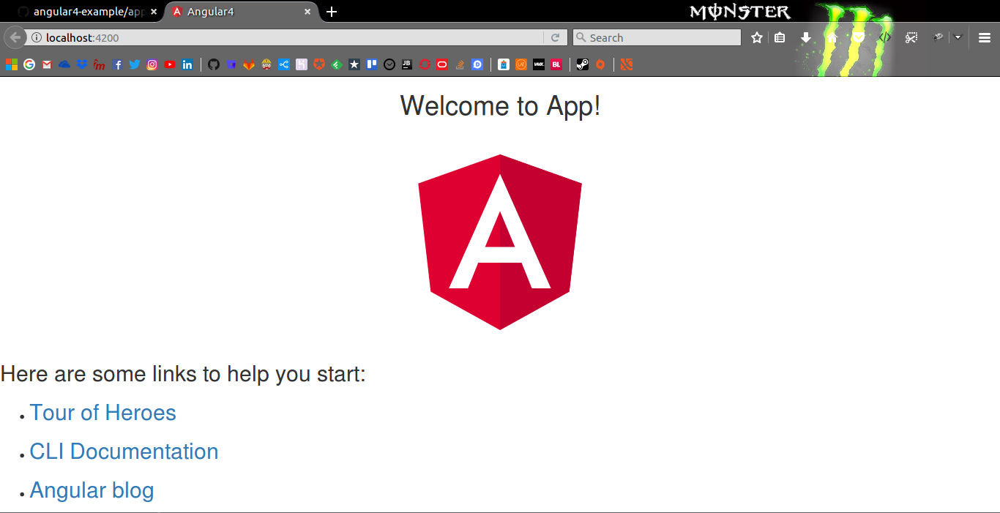

# First Angular Application :: Belajar Angular4

Sample template angular-cli application.

## Undestanding browser say `Hello to app`

Untuk memahami bagaimana browser menampilkan `Hello to app` kita harus pahami dulu stepnya di antarnya:

* `src/app/app.component.ts`
* `src/app/app.component.html`
* `src/index.html`

OK, show me the code!!!

### `src/app/app.component.ts`

```ts 
import { Component } from '@angular/core';

@Component({
  selector: 'app-root',
  templateUrl: './app.component.html',
  styleUrls: ['./app.component.css']
})
export class AppComponent {
  title = 'app';
}
```

Koding diatas adalah implementasi dari component di angular4 jadi component ini dia mengurus atau mendeklarasi yang mana view dan model serta binding data untuk view-model. Di component terlihat ada annotation which is decorator (`@Component()`) nah decorator component itu memili property yang wajid bada yaitu `selector` dan (`templateUrl` atau `template`)

Penjelasan properties yang ada di `@Component({...})` 

* `selector` digunakan untuk membuat tag atau attribut custome di html contohnya di halaman `index.html` nanti pasti ada attribut `<app-root></app-root>`
* `template` berisi element html yang nantinya akan di includekan element html yang memiliki seletor `app-root` tersebut.

Selanjutnya kita didalam `class` `AppComponent` memiliki sebuah variable dengan nama `title` yang di beri nilai `app`, ok seperti itulah penjelasan tentang component. selanjutnya kita lihat di view yaitu `app.component.html`

### `src/app/app.component.html`

Nah jadi view `src/app/app.component.html` dipanggil dari `src/app/app.component.html` dengan menggunakan `templateUrl` dari `@Component` pada class `AppComponent`. jadi component tersebut mendifinisikan bahwa viewnya akan merender file `app.component.html` nah jadi seperti berikut isinya:

```html
<!--The content below is only a placeholder and can be replaced.-->
<div style="text-align:center">
  <h1>
    Welcome to {{title}}!
  </h1>
  
</div>
<h2>Here are some links to help you start: </h2>
<ul>
  <li>
    <h2><a target="_blank" href="https://angular.io/tutorial">Tour of Heroes</a></h2>
  </li>
  <li>
    <h2><a target="_blank" href="https://github.com/angular/angular-cli/wiki">CLI Documentation</a></h2>
  </li>
  <li>
    <h2><a target="_blank" href="https://blog.angular.io/">Angular blog</a></h2>
  </li>
</ul>
```

Nah klo anda perhatikan diatas ya, isinya pada dasarnya sama seperti perintah HTML biasa hanya mungkin ada yang berbeda yaitu

```html
<h1>
  Welcome to {{title}}!
</h1>
```

Ok jadi initnya untuk menampilkan `Welcome to app` itu angular menggunakan Data Binding? apa itu Data Binding.

Jadi Data Binding itu sama dengan Komuikasi antara view dan component dengan menggunakan perantara diantaranya ada 

* String Interpolation
* Property Binding
* Event Binding
* Two way Binding

Nah jadi dengan menggunakan double kurung kurawal `{{` di ikuti dengan property yang di define di component contohnya seperti `title` `}}` maka akan menampilkan `Welcome to app`. nah jadi itu namanya String Interpolation.

### `index.html`

Nah jadi selector `app-root` yang ada dalam component alias yang menampilkan content `Welcome to app` ditampilkannya melalui `index.html` seperti berikut:

```html
<!doctype html>
<html lang="en">
<head>
  <meta charset="utf-8">
  <title>FirstNgApp</title>
  <base href="/">

  <meta name="viewport" content="width=device-width, initial-scale=1">
  <link rel="icon" type="image/x-icon" href="favicon.ico">
</head>
<body>
  <app-root></app-root>
</body>
</html>
```

Maka ketika di jalankan hasilnya seperti berikut:


